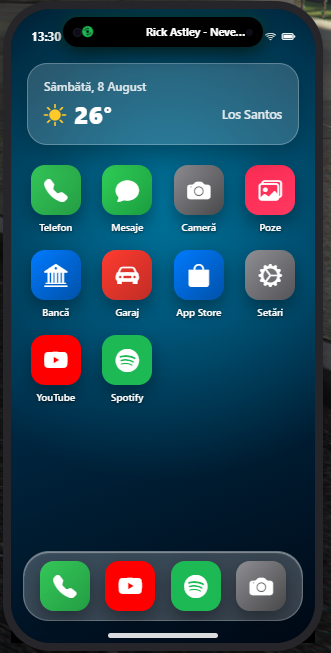
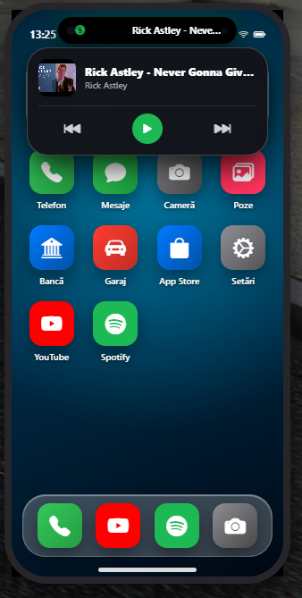

# 📱 OZONE Phone 14 Pro Max (FiveM vRP Resource)

> ⚠️ **STATUS: ÎN DEZVOLTARE / WORK IN PROGRESS** ⚠️
> *Acest script de telefon este în curs de dezvoltare activă. Aplicațiile, design-ul iOS 16 și funcțiile sunt optimizate continuu.*

Un telefon ultra-modern stilizat **iOS 16 (iPhone 14 Pro Max)** dezvoltat special pentru serverele de **FiveM (Framework vRP)**. Conține animații fluide, sticlă mată (glassmorphic), suport streaming media real și integrare 3D camera.

---

## 📸 Prevazualizare (În Dezvoltare)




---

## ✨ Funcționalități & Aplicații Principale

- **📱 Design Autentic iOS 16**:
  - Interfață completă cu Glassmorphism, Dock Bar, Lock Screen și animații Face ID.
  - Centru de Control (Control Center) interactiv (luminozitate, volum, Mod Avion, WiFi, 5G).

- **🎵 Dynamic Island Live Music Controller**:
  - Pastilă interactivă în bara de sus care detectează muzica activă de pe YouTube / Spotify.
  - Egaleazator audio verde animat și disc rotativ.
  - **Mini Player Flotant Extins**: La un simplu tap/click pe pastilă se deschide player-ul flotant cu butoane de Play/Pause, Piesa Anterioară/Următoare și copertă album.

- **📺 Aplicație YouTube Mobile**:
  - Căutare live de piese și videoclipuri cu interfață Piped / YouTube API.
  - Player cinema integrat și streaming în fundal.
  - Drawer modal pentru contul Google/YouTube al jucătorului.

- **🎧 Aplicație Spotify Music**:
  - Design autentic `#121212` dark green cu disc de vinil animat și coperți HD.
  - Redare audio fără pauză în fundal.

- **📸 Cameră 3D & Galerie Poze**:
  - Vizor cu orientare directă pe fața personajului (Selfie Stance).
  - Galerie foto foto-lightbox interactivă.

- **🏦 Maze Bank & Garaj Auto**:
  - Transfer de bani rapid între jucători.
  - Localizare vehicule pe hartă prin waypoint-uri GPS.

- **📞 Apeluri Dual SIM & Mesaje**:
  - Sistem de apeluri cu ID/Cartelă SIM, ringtone custom sintetizat și cronometru de convorbire.

---

## 🛠️ Instalare pe Server FiveM

1. Descarcă folderul `phone` și plasează-l în folderul resurselor tale:
   `resources/[scripts]/phone`
2. Adaugă pornirea resursei în `server.cfg`:
   ```cfg
   ensure phone
   ```
3. Tasta default pentru deschiderea telefonului în joc: **`F1`** (sau comanda `/phone`).

---

## ⚙️ Cerințe
- Server FiveM cu **vRP Framework**.
- NUI Focus activat.

---

*Dezvoltat cu pasiunea pentru UI/UX de calitate superioară.* 🚀
